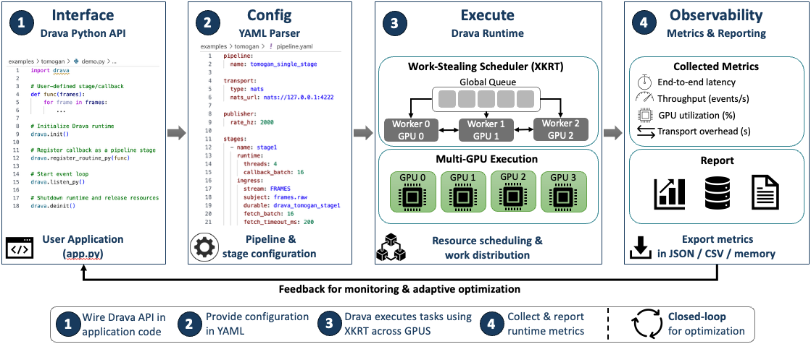
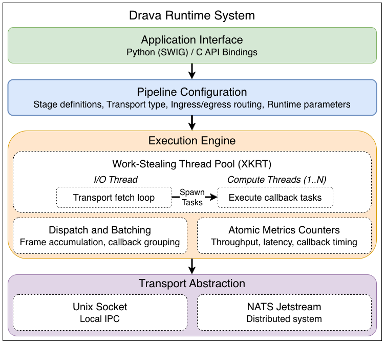

# Drava

Drava is an event-driven runtime for edge scientific streaming pipelines. At
facilities like the Advanced Photon Source, detectors produce data faster than it
can be shipped to a central site, so reconstruction and inference must run near
the instrument under latency and throughput constraints. Drava runs these
multi-stage pipelines and manages the system concerns that are usually left to
manual tuning, such as batching, data transport, and resource placement.

A developer writes each stage as a reusable callback. The runtime manages
scheduling, microbatching, data movement, and transport-aware execution across
heterogeneous resources, which separates the scientific logic from the system
concerns. Drava is built on the [xkrt](https://gitlab.inria.fr/xkaapi/dev-v2)
tasking runtime.

## Programming model

A Drava workflow is a directed acyclic graph. Nodes are stages and edges are
transport routes. Each stage is defined by four elements:

1. an ingress route for incoming events,
2. a callback that performs the domain computation,
3. an egress route for publishing derived events,
4. runtime parameters that control batching, scheduling, and threads.

The application supplies the first three. The runtime parameters come from a YAML
configuration, so the same callback can run under different execution policies
without code changes. Stages are stateless functions triggered by data events,
which decouples application logic from runtime policy.

## Architecture

Drava is a layered runtime.

- **Application interface.** Callbacks are registered through a C or Python API.
- **Pipeline configuration.** A YAML file binds each stage to its transport,
  batching policy, and thread team.
- **Execution engine.** Built on xkrt. One I/O thread pulls messages from the
  transport. Compute threads run callback tasks with work-stealing. A
  microbatching layer accumulates messages and flushes them on a size threshold,
  an end-of-stream event, or a timeout. Lock-free atomic counters record metrics.
- **Transport.** Stages communicate by passing events over a transport, using a
  publish/subscribe model. Each stage subscribes to its ingress subject and
  publishes derived events to its egress subject. Two backends are
  interchangeable. Unix sockets are used for low-latency intra-node
  communication. NATS JetStream is used for durable publish/subscribe streaming
  across nodes, where a stage reads from a subject and a durable consumer
  redelivers messages after a disconnection.

## Measurement

Each stage records throughput, end-to-end latency, and GPU and CPU energy, and
exposes them programmatically and as per-run CSV and JSON. This observability
also drives an agentic (ytopt) search that tunes runtime knobs automatically. The
metrics schema is documented on Read the Docs.

## Results

On ptychography (PtychoNN) and tomography (TomoGAN) pipelines, evaluated on a
single JLSE GPU node (dual-socket AMD EPYC 7532 with one NVIDIA A100):

- about 31 kHz on the runtime message path,
- up to 2.36x higher throughput than a PvaPy baseline that drops frames beyond
  2 kHz, and about 2.6x higher than PvaPy's hand-tuned multi-consumer distributor,
- an agentic search that finds a configuration 2.24x faster than the best manual
  one while sampling 0.52 percent of the space.

## Documentation

Guides and the generated C and Python API reference are on Read the Docs:
<https://drava.readthedocs.io>.

## Example applications

| Example | Description |
| --- | --- |
| [PtychoNN](examples/ptychonn) | Two-stage ptychographic inference and stitching |
| [TomoGAN](examples/tomogan) | Single-stage tomographic denoising with energy reporting |
| [Iris KNN](examples/iris_knn) | Minimal single-stage inference |
| [Bare runtime](examples/bare_runtime) | Runtime message-rate ceiling, no model |
| [Dataflow](examples/dataflow) | Minimal transport demonstration |

## License and authors

Distributed under the terms in [LICENSE](LICENSE). Contributors are listed in
[AUTHORS](AUTHORS).
